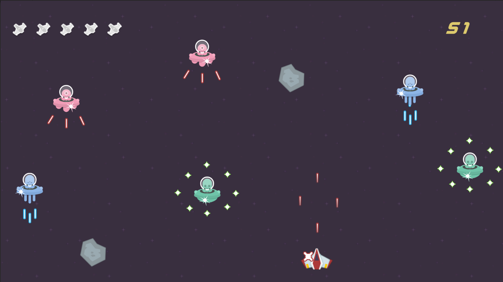

# Star Destroyer

Star Destroy is yet another space shooter game made for Kenney Jam 2022.

## Description

The aims of the game is to stay alive as long as possible with getting as many killls as possible.

The theme "Growth" is incorporated as a difficulity mechanic that 'grows' the player when getting hit, making the game even harder.

Currently added enemies are Circular, Triple and Default Aliens.

### Controls

- WASD - Moving the Ship

- Left Mouse Button - Shooting

### Planned Features

- SFX and Music

- High Score

- Upgrades and Different Attack Patterns

## Getting Started

### Dependencies

- To play the game -> Going to itch.io and playing on browser/downloading the build.

- To edit the game -> Unity

### Installing

- The game can be played on browser with WEBGL and the build can be downloaded on Itch.io.

## Authors

[@necrocultist.itch.io](https://necrocultist.itch.io)

[@AydanG.itch.io](https://aydang.itch.io)

## Version History

- 0.2
  - Various bug fixes
- 0.1
  - Initial Release, Jam Build

## Used Kenney Assets

- [Kenney/Planets](https://kenney.nl/assets/planets)
- [Kenney/Space Shooter Redux](https://kenney.nl/assets/space-shooter-redux)
- [Kenney/Alien UFO pack](https://kenney.nl/assets/alien-ufo-pack)

## Screenshot

